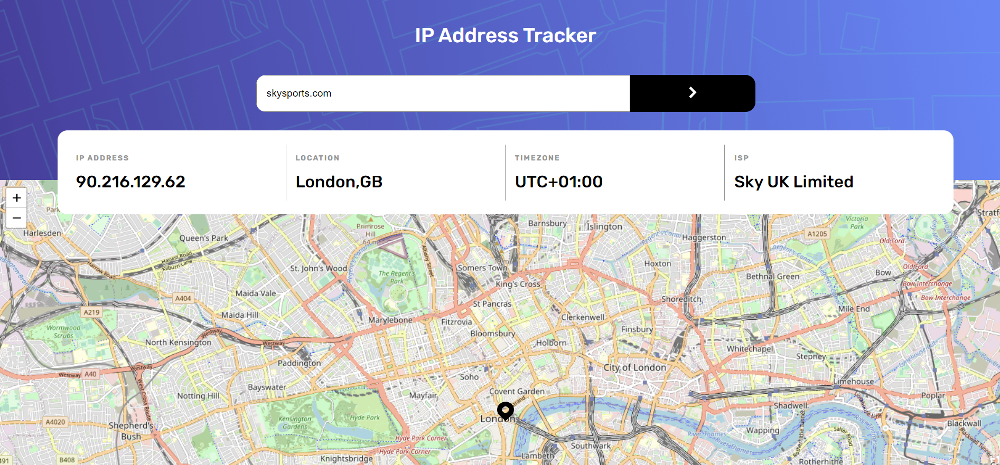

# Frontend Mentor - IP address tracker solution

This is a solution to the [IP address tracker challenge on Frontend Mentor](https://www.frontendmentor.io/challenges/ip-address-tracker-I8-0yYAH0).

## Table of contents

- [Overview](#overview)
  - [The challenge](#the-challenge)
  - [Screenshot](#screenshot)
  - [Links](#links)
- [My process](#my-process)
  - [Built with](#built-with)
  - [What I learned](#what-i-learned)
  - [Continued development](#continued-development)
  - [Useful resources](#useful-resources)
- [Author](#author)
- [Acknowledgments](#acknowledgments)

**Note: Delete this note and update the table of contents based on what sections you keep.**

## Overview

### The challenge

Users should be able to:

- View the optimal layout for each page depending on their device's screen size
- See hover states for all interactive elements on the page
- See their own IP address on the map on the initial page load
- Search for any IP addresses or domains and see the key information and location

### Screenshot



### Links

- Github Version/Frontend mentor??? : [Add solution URL here](https://your-solution-url.com)
- Live Version : [Add live site URL here](https://your-live-site-url.com)

## My process

### Built with

- Semantic HTML5 markup
- SASS and SASS variables with mixins.
- Media Queries
- Flexbox
- CSS Grid
- Mobile-first workflow
- [React](https://reactjs.org) - JS library.
- [Redux-Toolkit](https://redux-toolkit.js.org) - A library that controls state management.
- [React-Leaflet](https://react-leaflet.js.org) - Intergrated react components for Leaflet.js.
- [Leaflet.js](https://leafletjs.com) - A JS library for interactive maps.
- [IP Geolocation API](https://geo.ipify.org) - API that allows you to search for IP addresses accurately.
- [Axios](https://axios-http.com) - Promise based HTTP client library that helps deal with APIs in the browser.
- [React-Toastify](https://fkhadra.github.io/react-toastify/introduction) - Small library that adds notification messages.

### What I learned

One of the main things i learned was how using redux toolkit is good for state management. Which i think using the slice and the store overall is a better, more orginised way of controlling the state. In comparison to different ways like using useContext and useReducer.

I feel the benefits of the slice and store would really start to show on bigger projects than this because having a slice for each feature and a store for that feature allows us to keep track of a projects state alot easier by breaking it down into their own individual parts. Rather than keeping the overall state in one place that would grow over time and become harder to manage. (Especially when using alot of types/actions and dispatches).

E.G - Here we handle the data from the API directly in the extraReducer action in the slice and send it straight to the state. 
```js 
extraReducers: {
    [getInitialIp.fulfilled]: (state, { payload }) => {
      state.ipAddress = payload.ip;
      state.isp = payload.isp;
      state.lat = payload.location.lat;
      state.long = payload.location.lng;
      state.timezone = payload.location.timezone;
      state.domain = payload.as.domain;
      state.location = payload.location;
      state.isLoading = false;
    },
}
```

We then can make the state data, for the ip/slice feature, available thoughout the application though the store.
``` js 
export const store = configureStore({
  reducer: {
    ip: IpReducer,
  },
});
```

### Continued development

In this project i used leaflet.js for only the second time and i found exploring their documentation really interesting and showed me a lot of different ways a map library can be used. Which has inspired me to, in the future, build my own map based project.

I also did more research around maps and how they can be used and customised which lead me to discover sites like [Maptiler](https://www.maptiler.com). Where you can use pre-made or custom maps for your application. These inspired me further and i will definitely be using these type of resources when i create my own map based application in the future. 

## Author

- Website - [David Henery](https://www.djhwebdevelopment.com)
- Frontend Mentor - [@David-Henery4](https://www.frontendmentor.io/profile/David-Henery4)
- Linkedin - [David Henery](https://www.linkedin.com/in/david-henery-725458241)

